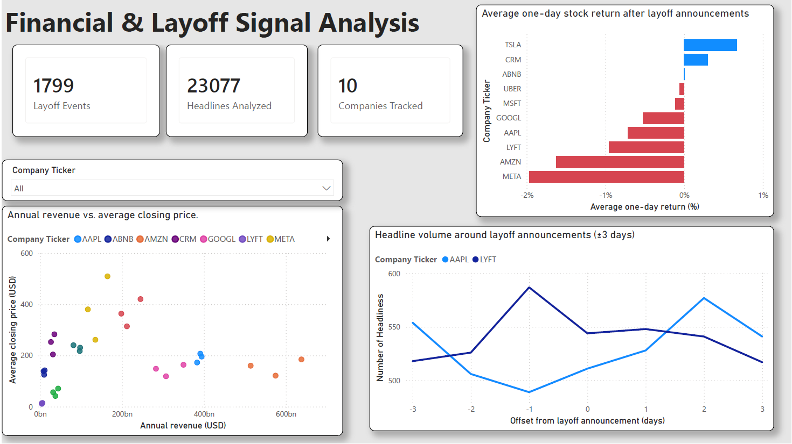

# Multi-Source Financial Event Analysis

An end-to-end financial data engineering and analytics project integrating **SEC financial statements, historical stock prices, financial news, and corporate layoff events** to analyze how company fundamentals and major events relate to market behavior.

The project combines **Python-based data cleaning, BigQuery SQL analysis, and Power BI visualization** to transform heterogeneous financial datasets into analysis-ready tables and interactive insights.

## Project Overview

Financial analysis often requires combining information from multiple sources with different schemas, time frequencies, and data-quality issues.

This project builds a multi-source pipeline that integrates:

* SEC financial statement data
* Historical stock market data
* Financial news data
* Corporate layoff events

The processed datasets are loaded into **Google BigQuery**, where SQL queries are used to investigate relationships between company performance, market movements, and corporate events.

A **Power BI dashboard** provides an interactive view of the resulting financial and event-level insights.

## Dashboard

The dashboard summarizes company financial performance, stock-price movements, and event-related market behavior across the companies included in the analysis.

## Data Pipeline

```text
SEC Financial Data ───────┐
                          │
Stock Price Data ─────────┤
                          │
Financial News ───────────┼──> Python Data Cleaning
                          │          │
Layoff Events ────────────┘          ▼
                                Cleaned Tables
                                      │
                                      ▼
                                Google BigQuery
                                      │
                           ┌──────────┴──────────┐
                           ▼                     ▼
                      SQL Analysis         Power BI
```

The workflow consists of four main stages:

1. **Data ingestion** – Collect financial, market, news, and event datasets from multiple sources.
2. **Data cleaning** – Standardize schemas, dates, ticker symbols, company names, and numerical fields using Python and Pandas.
3. **Cloud analytics** – Load processed tables into BigQuery and perform cross-dataset analysis using SQL.
4. **Visualization** – Present key financial and event-level insights through Power BI.

## Data Engineering & Cleaning

The source datasets contained several inconsistencies that required preprocessing before they could be reliably joined.

Examples of data-quality issues addressed include:

* Inconsistent ticker formats such as `$TSLA`
* Duplicate company-date observations
* Malformed or inconsistent dates
* Negative or invalid trading-volume values
* Inconsistent company naming conventions
* Missing and irregular layoff records
* Different schemas and granularities across datasets

Python preprocessing scripts standardize these fields and create consistent identifiers that allow the datasets to be integrated in BigQuery.

## Analysis

### Revenue and Stock Performance

SEC financial data is joined with historical stock-price data to examine relationships between company revenue and market performance.

The analysis demonstrates:

* Multi-table joins across financial and market datasets
* Time-based aggregation
* Financial metric comparison across companies
* Integration of fundamental and market data

### Market Reaction to Layoff Events

Layoff announcements are connected with stock-price data to examine market behavior surrounding corporate workforce reductions.

The analysis compares stock performance around event dates to evaluate whether layoffs coincide with noticeable short-term market movements.

### News Activity Around Corporate Events

Financial news data is analyzed around layoff events using an event window surrounding each announcement.

This allows the project to investigate whether major corporate events are associated with increased financial-news coverage and changes in market activity.

## BigQuery & SQL

The analytical layer is implemented in **Google BigQuery**.

SQL is used for:

* Multi-table joins
* Aggregations
* Date-based matching
* Window functions
* Event-window construction
* Company-level financial comparisons

Example analyses are stored in:

```text
sql/
├── revenue_vs_stock.sql
└── layoff_market_reaction.sql
```

BigQuery execution plans are also included to demonstrate how the analytical queries were processed.

## Repository Structure

```text
financial-market-analytics-pipeline/
│
├── README.md
│
├── sql/
│   ├── revenue_vs_stock.sql
│   └── layoff_market_reaction.sql
│
├── python_code/
│   └── Financial_analytics_notebook.ipynb
│
├── assets/
│   ├── revenue_vs_stock_price.png
│   ├── news_activity_around_layoffs.png
│   └── PowerBI_dashboard.png
│
└── data/
    ├── Layoff.csv
    ├── News.csv
    └── Stock.csv
```

## Technologies

**Languages & Data Processing**
* Python
* Pandas
* SQL

**Cloud & Database**

* Google BigQuery

**Visualization**

* Power BI
* Matplotlib

**Data Sources**

* SEC financial statements
* Historical stock prices
* Financial news
* Corporate layoff data

## Key Skills Demonstrated

* ETL / ELT pipeline development
* Multi-source data integration
* Data cleaning and validation
* Financial data analysis
* SQL joins and window functions
* Cloud-based analytics with BigQuery
* Event-window analysis
* Business intelligence dashboard development
* Data visualization
